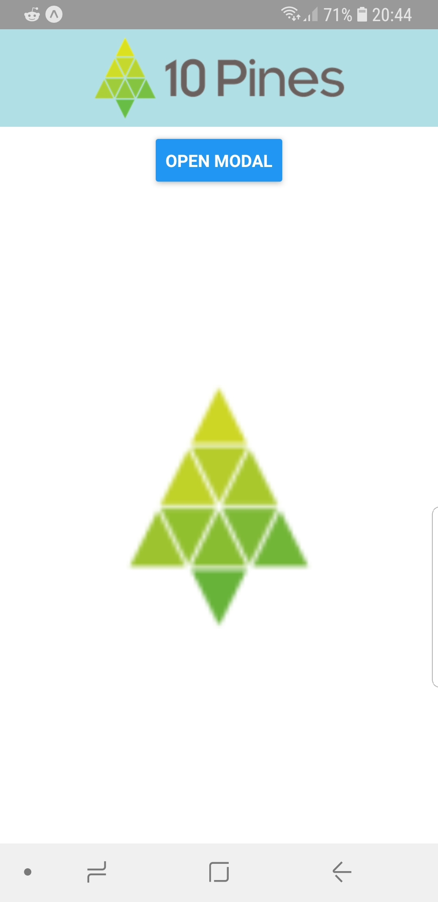
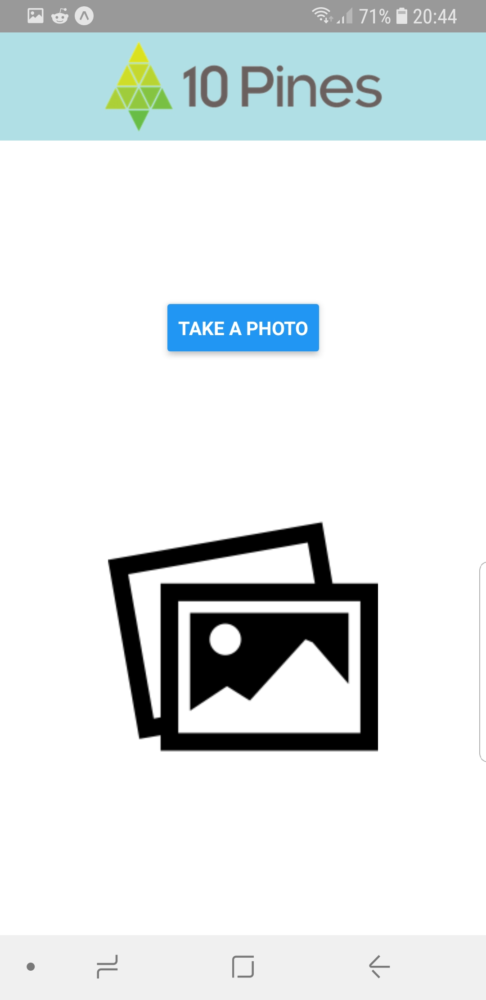
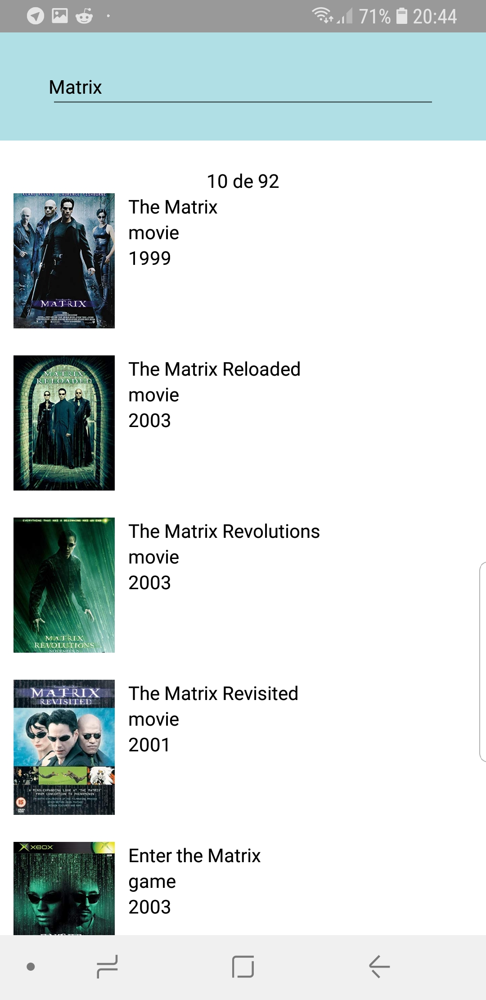

&nbsp;&nbsp;&nbsp;&nbsp;&nbsp;&nbsp;

This project was bootstrapped with [Create React Native App](https://github.com/react-community/create-react-native-app).

To install create-react-native-app

```
npm install -g create-react-native-app
```

### To Start running the project

```
npm install
npm start
```

or if you prefer yarn

```
yarn install
yarn start
```

### Installing React devtools for react native

```
npm install -g react-devtools
```

### Adding dependencies to enable debugging

We need to install Android Debug Bridge

```
sudo apt-get install android-tools-adb android-tools-fastboot
```

First we need to get the device ID

```
adb devices
```

Then we have to connect Android Debug Bridge with the device

```
adb -s <device name> reverse tcp:8081 tcp:8081
```

More info in [React Native Docs](https://facebook.github.io/react-native/docs/running-on-device)

### `npm start`

Runs your app in development mode.

Open it in the [Expo app](https://expo.io) on your phone to view it. It will reload if you save edits to your files, and you will see build errors and logs in the terminal.

Sometimes you may need to reset or clear the React Native packager's cache. To do so, you can pass the `--reset-cache` flag to the start script:

```
npm start --reset-cache
# or
yarn start --reset-cache
```

#### `npm test`

Runs the [jest](https://github.com/facebook/jest) test runner on your tests.

#### `npm run ios`

Like `npm start`, but also attempts to open your app in the iOS Simulator if you're on a Mac and have it installed.

#### `npm run android`

Like `npm start`, but also attempts to open your app on a connected Android device or emulator. Requires an installation of Android build tools (see [React Native docs](https://facebook.github.io/react-native/docs/getting-started.html) for detailed setup). We also recommend installing Genymotion as your Android emulator. Once you've finished setting up the native build environment, there are two options for making the right copy of `adb` available to Create React Native App:

##### Using Android Studio's `adb`

1. Make sure that you can run adb from your terminal.
2. Open Genymotion and navigate to `Settings -> ADB`. Select “Use custom Android SDK tools” and update with your [Android SDK directory](https://stackoverflow.com/questions/25176594/android-sdk-location).

##### Using Genymotion's `adb`

1. Find Genymotion’s copy of adb. On macOS for example, this is normally `/Applications/Genymotion.app/Contents/MacOS/tools/`.
2. Add the Genymotion tools directory to your path (instructions for [Mac](http://osxdaily.com/2014/08/14/add-new-path-to-path-command-line/), [Linux](http://www.computerhope.com/issues/ch001647.htm), and [Windows](https://www.howtogeek.com/118594/how-to-edit-your-system-path-for-easy-command-line-access/)).
3. Make sure that you can run adb from your terminal.

#### `npm run eject`

This will start the process of "ejecting" from Create React Native App's build scripts. You'll be asked a couple of questions about how you'd like to build your project.

**Warning:** Running eject is a permanent action (aside from whatever version control system you use). An ejected app will require you to have an [Xcode and/or Android Studio environment](https://facebook.github.io/react-native/docs/getting-started.html) set up.

## Customizing App Display Name and Icon

You can edit `app.json` to include [configuration keys](https://docs.expo.io/versions/latest/guides/configuration.html) under the `expo` key.

To change your app's display name, set the `expo.name` key in `app.json` to an appropriate string.

To set an app icon, set the `expo.icon` key in `app.json` to be either a local path or a URL. It's recommended that you use a 512x512 png file with transparency.
